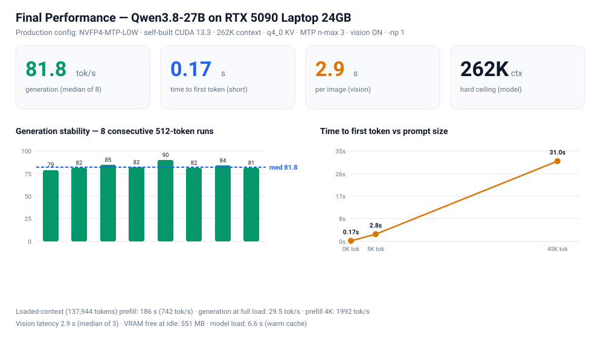

# Qwen3.8-27B · 单卡 24GB 极限调优实录

**从 53 个社区量化变体中筛出最优解，并逐层压榨到硬件极限的完整实测**

[English →](./README_EN.md) ｜ [工具脚本 →](./scripts) ｜ [原始数据 →](./data)

[](https://huggingface.co/Qwen/Qwen3.8-27B)
[]()
[]()
[]()
[]()
[](#许可)

---

## 🏆 最终结论（TL;DR — 直接照抄）

| 维度 | 结果 |
|---|---|
| **生成速度** | **81.8 tok/s**（8 轮中位，波动 ±4%）|
| **首 token 延迟** | **0.17 秒**（短问）· 2.8 秒（4K 材料）· 31 秒（45K 材料）|
| **上下文** | **256K**（= 262,144 tokens，模型硬上限·已实测验证）|
| **视觉** | ✅ 开启，**2.9 秒/张** |
| **满载生成** | 29.5 tok/s（装载 13.8 万 tokens 后）|
| **装载速度** | 1992 tok/s（4K prefill）|

**一行命令启动**（PowerShell 粘贴回车；关闭窗口即停止）：

```powershell
& "D:\llama.cpp\build\bin\llama-server.exe" -m "D:\models\Qwen3.8-27B\Qwen3.8-27B-NVFP4-MTP-LOW.gguf" --mmproj "D:\models\Qwen3.8-27B\mmproj-Q8_0.gguf" -ngl 99 -fa on -fit off -c 262144 -np 1 --cache-type-k q4_0 --cache-type-v q4_0 --ctx-checkpoints 4 --spec-type draft-mtp --spec-draft-n-max 3 --reasoning-effort xhigh --reasoning-budget 12000 --chat-template-file "D:\models\Qwen3.8-27B\custom_template.jinja" --temp 1.0 --top-p 0.95 --top-k 20 --min-p 0.0 --host 127.0.0.1 --port 8082 --load-mode none --jinja
```

**统一底座**：NVFP4-MTP-LOW（14.47 GiB）· **q4_0 KV** · 自编译 CUDA 13.3 · RTX 5090 Laptop 24GB



### 📦 需要下载的三件套

| 文件 | 大小 | 获取地址 |
|---|---|---|
| **Qwen3.8-27B-NVFP4-MTP-LOW.gguf**（主力模型）| 14.47 GiB | [**esatapedico / Qwen3.8-27B-NVFP4-MTP-GGUF**](https://huggingface.co/esatapedico/Qwen3.8-27B-NVFP4-MTP-GGUF) → 选 **`LOW`** 档 |
| **mmproj-BF16.gguf**（视觉组件）| 888 MB | [Qwen / Qwen3.8-27B](https://huggingface.co/Qwen/Qwen3.8-27B) 官方仓库（可自行量化到 Q8_0 省 288 MB → [视觉配置指南](docs/vision-setup.md)）|
| **llama.cpp 引擎** | ~35 MB | [官方 CUDA 发布包](https://github.com/ggml-org/llama.cpp/releases)（或按[自编译配方](docs/windows-self-build-recipe.md)获得本仓库同款性能）|

> 🧩 **防过度思考模板**（`custom_template.jinja`）已包含在本仓库 → [scripts/custom_template.jinja](scripts/custom_template.jinja)
> 🌐 **国内加速**：把下载地址里的 `huggingface.co` 换成 `hf-mirror.com` 即可。

## ⚠️ 三个必须知道的真相（都是实测推翻旧结论）

1. **上下文硬上限是 262,144** —— llama.cpp 会把更大的 `-c` **静默封顶**。用短 prompt 完全看不出，只有超长输入才会暴露（详见 [上下文真相](docs/context-limits-and-yarn.md)）
2. **q4_0 KV 比 q8_0 更快** —— 同为 256K：q8_0 只有 **9.1 tok/s**，q4_0 有 **87~91 tok/s**。q4_0 不是"降质换容量"，**召回测试完全无损**
3. **YaRN 能到 1M，但只有 4~5 tok/s** —— 解锁参数（`--override-kv` + `--yarn-orig-ctx`）有效，但 llama.cpp 的 RoPE 缩放路径未优化；官方推荐的长上下文引擎是 **vLLM / SGLang**（需 32GB+ 显存）

## 🎯 10 秒决策

| 你的场景 | 选择 |
|---|---|
| 日常对话 / 编码 / agent（要视觉）| **256K + q4_0（上面一行命令）** ✅ |
| 想要更大的上下文 | 256K 是硬上限；YaRN 1M 实测仅 4-5 tok/s（[详情](docs/context-limits-and-yarn.md)）|
| 多客户端同时连接 | `-np 2`（各 131K）/ `-np 4`（各 65K，总吞吐 124 tok/s）|
| 真正的 1M 交互 | 需换 32GB+ 显存（vLLM 路线）|
| 多客户端同时连接 | `-np 2`（各 131K）/ `-np 4`（各 65K，总吞吐 124 tok/s）|
| 思考停不下来 | 已内置双保险（budget + 模板注入），无需操作 |

**七个反直觉发现**（全部有对照组实测数据）：

1. **上下文硬上限是 262,144** —— llama.cpp 会**静默封顶**更大的 `-c`（短 prompt 测不出来，只有超长输入才暴露）
2. **q4_0 KV 比 q8_0 更快** —— 同为 256K：q8_0 只有 **9.1 tok/s**，q4_0 达 **87~91**；且召回测试**无损**
3. **YaRN 能到 1M，但只有 4~5 tok/s** —— 解锁参数（`--override-kv` + `--yarn-orig-ctx`）确实有效，但性能不行（llama.cpp 的 RoPE 缩放路径未优化）
4. **一句系统提示词治好过度思考** —— 思考量 −46%、正文恢复输出（`presence_penalty` / 修复模板 / 降上下文均实测无效）
5. **自编译的工具链配对是硬红线** —— nvcc 12.8 + MSVC 让 MTP prefill 慢 57 倍（[上游 #28790](https://github.com/ggml-org/llama.cpp/issues/28790)，已定位修复）
6. **一堆"社区推荐"参数在本机是负优化**：`-ub 1024`（−16%）、`--spec-default`（−39%）、iMatrix 混合量化（−27%）
7. **注意力的真实成本**：空载 82 tok/s → 装载 13.8 万 tokens 后降到 **29.5 tok/s**（每生成一步都要读完整个 KV）
8. **n-max 3 与 4 几乎打平** —— 严格交叉测试（各 15 样本）显示 4 平均快 3~4%，但**波动大一倍**（69~101 vs 74~89 tok/s）→ **最终保留 3**（稳定优先）。详见 [对比报告](data/nmax-3-vs-4-comparison.md)

## 📜 七轮调优历程

| 轮次 | 主题 | 关键收获 |
|---|---|---|
| 1 | **量化选型**（53 → 1）| NVFP4-LOW 胜出（速度双冠、质量打平）|
| 2 | **KV + MTP 调优** | MTP n-max 3（生成 +40%）|
| 3 | **思考控制** | xhigh 修复：`--reasoning-budget` + 模板注入 |
| 4 | **自编译引擎** | CUDA 13.3 官方配对：prefill +13% · 修复上游 bug |
| 5 | **上下文修正（一）** | 150K → 180K（发现 `-np 1` 释放 1.15 GB 显存）|
| 6 | **穷尽复查** | 40+ 参数全排查，确认无遗漏 |
| 7 | **上下文真相（本轮）** | **q4_0 KV 让 256K 真正可用**（+45% 上下文、速度更快）· 揭开静默封顶与 YaRN 真相 |

## 📊 成绩单（最终配置实测）

| 维度 | 数值 |
|---|---|
| 生成速度 | **81.8 tok/s**（8 轮中位，波动 ±4%）|
| 首 token 延迟 | **0.17 s**（短问）· 2.78 s（4K）· 30.97 s（45K）|
| 长文本处理 | **1992 tok/s**（4K prefill）｜ 45K 输入 31 秒 |
| 视觉识别 | **2.9 秒/张**（Q8 mmproj，3 轮中位）|
| 上下文 | **262,144**（模型硬上限；q4_0 KV 让它真正可用）|
| 满载生成 | 29.5 tok/s（装载 13.8 万 tokens 后）|
| 显存余量 | 551 MB @ 256K（视觉模式）|
| 并发能力 | `-np 2` 各 131K（总吞吐 113）｜ `-np 4` 各 65K（总吞吐 124）|
| 散热 | 12 分钟满载**零衰减** |
| 思考控制 | xhigh + 双保险（budget 12000 + 模板注入）|


> 📖 详细文档：[docs/](./docs) ｜ 原始数据：[data/](./data)

---

## 🥇 模型选型：53 → 1

**最终赢家：NVFP4-MTP-LOW + q8_0 KV + MTP n-max 3 + llama.cpp b10889**

```powershell
# 一键启动（先改脚本顶部的两个路径变量）
.\scripts\start-nvfp4-low.ps1        # → http://127.0.0.1:8082
```

### 三方终极对决（各自最优配置 · 同一台机器 · 同条件）

| | 🥇 **NVFP4-LOW** | 🥈 IQ3_S | 🥉 UD-Q4_K_S |
|---|---|---|---|
| **生成速度** | **79.6 tok/s** | 64.4 tok/s | 51.7 tok/s |
| **15.6K 长输入** | **9.7 s** | 14.9 s | 19.9 s |
| **最大上下文** | 200K（推荐 192K） | **212K**（极限 240K） | 200K |
| **模型体积** | 14.47 GiB | **11.29 GiB** | 14.30 GiB |
| **量化方式** | 全 NVFP4 + 轻量头部 | GSQ-RCO 混合（~3.5 bpw） | 动态 Q4_K_S（~4.4 bpw） |
| **质量** | 打平 | 打平（**任务无损**，有学术验证） | 打平（细节最严谨） |
| **定位** | **日常主力** ✅ | 超长材料备胎 | 存档 |

> **一句话**：NVFP4-LOW 在三方中速度双冠（生成 +24%、长输入 −35% vs 次优），质量与 BF16 的差距在社区 4,800 任务受控测试中不可测。IQ3_S 仅在你需要 21 万+ token 上下文时才值得切换。


---

## 📌 三条核心结论（2026-09-15 更新）

1. **q4_0 KV 是上下文翻倍的关键** —— 同为 256K：q8_0 只有 **9.1 tok/s**，q4_0 达 **87~91**，且召回测试无损。
   > *历史修正*：早期"q4_0 系 KV 慢 28 倍"的结论是**混合类型**（`K=q8_0 + V=q4_0`）下的伪影——**全 q4_0 没有这个问题**，详见 [上下文真相](docs/context-limits-and-yarn.md)。
2. **MTP 参数不必细调** —— n-max 3 是最优（经严格交叉测试验证：n-max 4 平均快 3~4% 但**波动大一倍**）。接受率高 ≠ 速度快。
3. **引擎版本的影响力与量化类型强相关** —— b10840 → b10889 给 NVFP4 白送 +6.6% 速度与 +48K 容量，给 K-quant 却是 −11%。**升级引擎后必须重测容量。**

---

## 📊 完整测试结果

> ⚠️ **以下为各轮次的历史测量记录**（保留以展示完整过程）；**当前最优配置与最新数据以顶部 TL;DR 为准**，最新轮次数据见 [data/round3-6-latest.md](data/round3-6-latest.md)。

### 1️⃣ 上下文容量：KV 量化是关键


| 模型 | F16 KV 上限 | **q8_0 KV 上限** | q4_0 系 KV |
|---|---|---|---|
| IQ3_S | 136K | **212K**（极限 240K） | 256K ⚠️ 慢 28×（混合类型伪影，见注） |
| NVFP4-LOW | 96K | **200K** | — |
| NVFP4-MID-HIGH | 88K | ~160K（估算） | — |
| UD-Q4_K_S | 96K | 200K | — |

**慢路径证据**（同一段 15.6K 输入的处理耗时）：

| 配置 | 耗时 | 判定 |
|---|---|---|
| 32K + F16 KV | 13.6 s | 基准 |
| 136K + F16 KV | 15.2 s | 无惩罚 |
| 200K + **q8_0** | **15.1 s** | **无惩罚** ✅ |
| 256K + **q4_0 系** | **~420 s 仍未完成** | ❌ 内核回退，吞吐从 286 衰减到 29 tok/s |

### 2️⃣ 速度对决（两代引擎交叉验证）

| 模型 | 引擎 b10840（旧） | 引擎 b10889（新） | 变化 |
|---|---|---|---|
| **NVFP4-LOW** | 74.7 tok/s / 152K / 10.1s | **79.6 / 200K / 9.7s** | **+6.6%、+48K** |
| IQ3_S | 61.9 / 212K / 15.5s | 64.4 / 212K / 14.9s | +4% |
| UD-Q4_K_S | 58.3 / 152K / 15.2s | 51.7 / 200K / 19.9s | **−11%**（无益） |

**机制解释**：
- **LOW 为什么最快**——轻量头部（Q5_0 输出层 + IQ4_XS MTP 头）让每次 MTP 验证/草稿读取成本最低。社区在桌面 5090 上观察到同样规律。
- **UD 接受率最高（73%）却最慢**——K-quant 每轮验证成本最贵（反量化开销）且无 FP4 加速。
- **NVFP4 的 FP4 优势只在 prefill 兑现**（10 s vs 15–20 s 级）；decode 优势来自头部设计而非文件大小。

### 3️⃣ MTP 参数全扫描（三方交叉验证）

| 配置 | NVFP4-LOW | IQ3_S | UD-Q4_K_S | 判定 |
|---|---|---|---|---|
| **n-max 3** | **74.4** | **63.2** | **59.3** | 🏆 三方共同最优 |
| n-max 2 | 66.7 | 61.0 | 54.7 | 慢 7–10% |
| n-max 4 | 启动崩（差 594 MiB） | 63.5（无收益） | 未测 | 不可用/无收益 |
| n-max 3 + p-min 0.75 | 64.6（接受率虚高至 85%） | — | — | 吞吐 −13% |

> 关键洞察：**n-max 4 的验证批次需要额外 ~594 MiB 显存**，在 24GB 卡的贴边配置下不可用；即使可用也无收益。

### 4️⃣ 代码质量：三方打平

**同题对决**（单文件贪吃蛇，5 项明确需求）：

| 维度 | IQ3_S | NVFP4-MID-HIGH | UD-Q4_K_S |
|---|---|---|---|
| 完整可运行 / 需求覆盖 / 防反向 / 食物避蛇身 | ✅ | ✅ | ✅ |
| **尾节排除**（高级细节） | ✗ | ✗ | **✅ 唯一** |
| 输出长度 | 3,985 字符 | 5,624 字符 | 4,164 字符 |
| 长文召回（12K/70% 与 150K/80% 深度） | ✅ | ✅ | ✅ |

### 5️⃣ 散热压测：12 分钟满载零衰减


| 指标 | 第 1 轮 | 第 100 轮 |
|---|---|---|
| 生成速度 | 78.7 tok/s | **83.7 tok/s（无衰减）** |
| GPU 温度 | 55 °C | 77 °C（稳定平台） |
| 功耗 | 132 W | 145 W |
| SM 时钟 | 1830 MHz | 1740 MHz（−5%） |

**结论：笔记本散热完全扛得住长时间 agent 负载。** 速度波动（±10%）来自 MTP 接受率的内容随机性，与温度无关。

---

## 👁 视觉支持（2026-09-11 新增）

模型是 VLM，视觉组件（mmproj）需单独获取，且可**自行量化省显存**：

| 操作 | 命令 / 结果 |
|---|---|
| 获取 | `mmproj-BF16.gguf`（888 MB，来自 HF 的 Qwen3.8-27B repo）|
| **自行量化** | `llama-quantize mmproj-BF16.gguf mmproj-Q8_0.gguf Q8_0` → **600 MB**（实测识别质量与 BF16 相同）|

**★ 视觉模式的速度-上下文曲线**（非线性悬崖，注意最后一档）：

| 上下文 | 生成速度 | 视觉耗时 | 判定 |
|---|---|---|---|
| 192K | 3.9 tok/s | 47 s | ❌ |
| 160K + `--ctx-checkpoints 4` | 37.2 tok/s | — | ❌ |
| 154K | 54.4 tok/s | — | ⚠️ |
| 152K | 63.6 tok/s | — | ⚠️ 下坡起点 |
| **180K + `--ctx-checkpoints 4` + `-np 1`** | **80~87 tok/s** | **4.2 s** | ✅ **推荐（新上限）** |
| 148K | 80.4 tok/s | — | ✅ |

> **重大修正（2026-09-13）**：早期"152K/160K 滑坡"结论是旧配置（默认 -np 4，显存只剩 158MB）的产物。生产配置（`-np 1`，余量 1.2GB+）下复测：**150K~180K 全平坦**（80~87 tok/s），192K 才滑坡（63）。**视觉模式推荐 180K**（余量 531MB，视觉 4.2s）；纯文本模式仍可用 192K。
> 完整指南与 API 示例：[docs/vision-setup.md](docs/vision-setup.md)

## 🧠 思考档位与预算（2026-09-11 新增）

**默认档 xhigh 在 API 场景是陷阱**（实测正文零输出，22,021 字符思考烧光 6,000 token 上限）：

| 配置 | 耗时 | 思考量 | 正文 | 结果 |
|---|---|---|---|---|
| xhigh 无预算 | 114 s | 22,021 字符 | **0** | ❌ |
| xhigh + **顶层**预算 3000 | 103 s | 10,059 | 6,386 | ✅ |
| xhigh + 模板内预算 3000 | 117 s | 22,207 | 0 | ❌ 参数被静默忽略 |
| **medium** | **37 s** | 826 | 4,274 | ✅ 推荐 |
| low | 27 s | 692 | — | ✅ 最快 |

**★ 关键坑**：`reasoning_budget_tokens` 必须放在**请求 JSON 顶层**——放进 `chat_template_kwargs` 里会被静默忽略。
> 完整指南（含正确/错误写法对照）：[docs/reasoning-guide.md](docs/reasoning-guide.md)

## 🔬 深度验证：iMatrix 对照与自编译实录（2026-09-12 新增）

**① iMatrix 混合量化（15.95 GiB）不值得换** —— 同题代码对决：质量打平（8/9 vs 8/9），但生成慢 27%、上下文少 48K、体积大 1.5 GiB。**印证：PPL 优势 ≠ 真实任务质量优势**。

**② 自编译版发现并修复了上游 MTP bug** —— 自编译（nvcc 12.8 + MSVC，不受支持的组合）开启 `--spec-type draft-mtp` 后 prefill 慢 57 倍；换到官方配对（**CUDA 13.3.33 + MSVC 19.44**）后完全修复且全项最快（prefill **1675.7** / decode **75.3~88.7** / 视觉 **4.5s**）。上游 issue：**[#28790](https://github.com/ggml-org/llama.cpp/issues/28790)**（含 DLL 互换法定点全过程）。


**③ 引擎升级情报** —— 官方最新 b10917 与 b10889 基本持平；**自编译版（CUDA 13.3 官方配对）已完全跑通并全面验证**，现已作为主力使用。可复现配方（含工具链红线 + 4 个坑）见 [docs/windows-self-build-recipe.md](docs/windows-self-build-recipe.md)。

**④ 参数红榜**：`--ctx-checkpoints 4` ✅ 有效（+79%）｜ `--spec-default` ❌ 负优化（−39%）｜ `n-max 8` ❌ 负优化。

**⑤ xhigh 过度思考的解法（实测）** —— 一句系统提示词让思考量直降 **46%**、正文从零恢复正常；`presence_penalty` / 148K / froggeric 模板均实测无效。详见 **[docs/xhigh-overthinking-fix.md](docs/xhigh-overthinking-fix.md)**。


> 自编译完整记录（四个坑 + 排查过程）：[docs/custom-build-and-mtp-bug.md](docs/custom-build-and-mtp-bug.md) ｜ 可复现配方：[docs/windows-self-build-recipe.md](docs/windows-self-build-recipe.md) ｜ 全部原始数据：[data/round2-new-results.md](data/round2-new-results.md)

---

## 🔍 筛选过程：53 → 1


| 阶段 | 数量 | 说明 |
|---|---|---|
| 生态扫描 | **53** | 8 个来源家族（esatapedico NVFP4 系 9+2+8+10 档、unsloth UD 系 20 档、DASLab GSQ-RCO 3 档、QUASAR 等） |
| 硬约束排除 | ~15 | 剔除：装不下（ORIG 33GB / HIGHEST 23GB / Q8 系）、实验性修补（SSMFIX 8 档）、第三方融合权重（TURBO-Fable 10 档）、无 MTP 头（BUDGET 系）、过低精度（IQ1/IQ2） |
| 入围实测 | 4 | IQ3_S · NVFP4-MID-HIGH · NVFP4-LOW · UD-Q4_K_S |
| 深度对决 | 3 | IQ3_S · NVFP4-LOW · UD-Q4_K_S |
| **胜出** | **1** | **NVFP4-MTP-LOW** |

**排除的两个典型**（值得说明，因为它们在 HF 上很显眼）：
- **SSMFIX 系列**：社区对 8 个晚期 SSM 层 conv1d 权重做缩放修补（假说：修复长上下文退化）。证据混杂（TruthfulQA +6~8pp 但 CMMLU −1.8、无长上下文验证），README 自标 "EXPERIMENT, NOT AN IMPROVEMENT"。
- **TURBO-Fable-Cold-Fusion 系列**：第三方融合调教版（去审查 + 减思考），非官方权重，基准为作者自报口径。

---

## ⚙️ 八条可复用经验

1. **`reasoning_effort` 是必设项** — 默认档（xhigh）实测 8,000 token 全烧在思考里、正文零输出。必须传 `{"chat_template_kwargs":{"reasoning_effort":"medium"}}`。社区 4,800 任务测试：xhigh 比 low 多烧 7–11 倍 token，只换 0–4.7 分。**永远不要关闭 reasoning**（NVFP4 关闭时 HumanEval+ 从 90 掉到 13/30）。
2. **q4_0 系 KV 有隐藏性能悬崖** — 容量看似最优（256K），实际长输入慢 28×。
3. **MTP 在 dense 模型是纯收益** — n-max 3 提速 +73~79%（MoE 模型上"MTP 减速"的经验不适用）。
4. **接受率高 ≠ 速度快** — 速度 = 每 pass 成本 × 每 pass 收益；轻头部设计比高接受率更重要。
5. **NVFP4 的 FP4 加速只在 prefill 兑现** — decode 是带宽受限，看的是头部设计。
6. **引擎收益与量化类型强相关** — 升级后必须重测容量（NVFP4 +48K，K-quant 反而退化）。
7. **大上下文对 K-quant 不友好** — LOW 在 200K 的 prefill 仍 9.7 s；UD 从 15.2 s 掉到 19.9 s。
8. **prompt cache 是最大的免费加速** — 同一段 15.6K 输入：冷启 15 s → 命中缓存 **2.3 s（6.5×）**。agent 长会话保持前缀稳定即可持续受益。

---

## 🛠 工具箱

`scripts/` 三个启动脚本（PowerShell，路径已参数化，**保存为 UTF-8 with BOM**）：

| 脚本 | 用途 | 关键参数 |
|---|---|---|
| `start-nvfp4-low.ps1` | 🏆 日常主力 | `-c 192000` + q8_0 KV + MTP n-max 3 |
| `start-iq3s.ps1` | 超长材料备胎 | `-c 212000`（可到 240K） |
| `start-nvfp4-midhigh.ps1` | 对比组 | `-c 84000` |

**使用前修改脚本顶部两个变量**：`$ENGINE_DIR`（llama.cpp 目录）、`$MODELS_DIR`（模型目录）。

> ⚠️ 两个已知坑（脚本已规避）：
> 1. **脚本必须 UTF-8 with BOM** — 否则 PowerShell 5.1 按 ANSI 解码中文注释会报"字符串缺少终止符"。
> 2. **b10889+ 移除了 `--no-mmap`** — 替代参数是 `--load-mode none`。

**API 调用要求（三个配置通用）**：
```json
{ "messages": [], "chat_template_kwargs": { "reasoning_effort": "medium" } }
```
思考模式采样 `temp 1.0 / top_p 0.95 / top_k 20`；非思考模式 `temp 0.7 / top_p 0.80 / top_k 20`。

---

## ❓ FAQ

**Q：为什么不直接开 256K（模型原生最大值）？**
A：能开，但要牺牲速度——256K 只有 q4_0 系 KV 装得下，而它会让长输入慢 28 倍（内核回退）。192K + q8_0 是"容量 / 速度 / 质量"三者的最佳平衡点。

**Q：q8_0 KV 会损失质量吗？**
A：实测与业界共识均为"近无损"。本项目的长文召回测试（12K/70% 与 150K/80% 深度）在 q8_0 KV 下全部通过。

**Q：为什么不选更高精度的 Q6/Q8 量化？**
A：它们在 24GB 卡上装不下（Q8_0 为 27 GiB）。4bit 已经是这个硬件等级的质量天花板——社区受控测试显示 4bit 与 FP8 在任务级统计打平。

**Q：LOW 的头部精度（Q5_0 / IQ4_XS）比 MID-HIGH（全 Q8_0）低，质量真的没差吗？**
A：作者的 PPL 数据：LOW 3.2761 / MEDIUM 3.2858 / MID-HIGH 3.2903（差异在误差范围内，LOW 甚至略优）；实测代码对决三方打平。头部精度对 PPL 的影响远小于骨干。

**Q：桌面版 5090 会快多少？**
A：本测试的 145 W 功耗墙是 Laptop 专属限制；桌面 5090（575 W）在 prefill 上通常快 2–3 倍，decode 快 1.5–2 倍。但**容量结论（KV 量化、上下文上限）可直接参考**。

**Q：16GB 卡怎么办？**
A：换成更小的档（如 NVFP4 家族 COMPACT-LOW 15.2 GB，或无 MTP 的 BUDGET/STARVED 14.6 GB），KV 用 q8_0，上下文压到 ~96K；或用 IQ3_S（11.3 GB）配更大上下文。

**Q：模型支持图像输入吗？**
A：支持（原生 VLM）。需另下 `mmproj-BF16.gguf`（~0.87 GB）并加 `--mmproj`，额外占用约 1 GB 显存。

**Q：可以同时跑多个实例吗？**
A：24GB 装不下两个 27B 实例。建议单实例切换（三种配置脚本已备，切换约 30 秒）。

**Q：为什么不用 vLLM / SGLang？**
A：在这类 Blackwell Laptop 上，它们的显存管理与 GGUF 量化生态不如 llama.cpp 灵活；且社区 NVFP4 权重主要以 GGUF 形式分发。vLLM 更适合服务端多并发场景。

---

## 📚 参考资料与延伸阅读

**模型与量化**
- [Qwen/Qwen3.8-27B](https://huggingface.co/Qwen/Qwen3.8-27B) — 基座模型（Apache-2.0）
- [esatapedico/Qwen3.8-27B-NVFP4-MTP-GGUF](https://huggingface.co/esatapedico/Qwen3.8-27B-NVFP4-MTP-GGUF) — 主力模型所在家族（9 档）
- [unsloth/Qwen3.8-27B-GGUF](https://huggingface.co/unsloth/Qwen3.8-27B-GGUF) — UD 动态量化家族
- DASLab GSQ-RCO — HuggingFace 搜索 `DASLab Qwen3.8-27B GSQ-RCO`

**引擎**
- [llama.cpp releases](https://github.com/ggml-org/llama.cpp/releases) — 需 Windows CUDA 包（主程序 + cudart 两个 zip 解压到同一目录）
- MTP 支持：启动加 `--spec-type draft-mtp`

**相关项目**
- [Qwen3.8-Flash-Next 177B 部署实录](https://github.com/lifeidle/qwen3.8-flash-next-5090-laptop-256k) — 同平台 MoE 大模型部署（三层内存分配 + 256K 上下文）

---

## 🔧 故障排查

| 症状 | 原因与解法 |
|---|---|
| 启动即退出、日志无内容 | 参数不兼容。新版引擎已移除 `--no-mmap`，用 `--load-mode none` |
| `failed to allocate buffer for kv cache` | 上下文超出显存。降 `-c` 或改用 q8_0 KV |
| 启动成功但推理卡死 | 显存贴边（余量 <200 MiB）。降 8–16K 上下文 |
| 生成全是思考、没有正文 | 未传 `reasoning_effort`；默认 xhigh 会烧光 token |
| 脚本报"字符串缺少终止符" | 脚本编码问题，另存为 UTF-8 with BOM |
| 输出乱码 | 请求体未按 UTF-8 编码（写 JSON 文件 + `curl --data-binary @file`） |

---

## 复现指南

```powershell
# 1. 引擎：下载 llama.cpp 官方 Windows CUDA 包（主程序 + cudart），解压到同一目录
# 2. 模型：从上方链接下载 GGUF（国内可用 hf-mirror.com 镜像）
# 3. 启动：修改脚本顶部两个路径变量后执行
.\scripts\start-nvfp4-low.ps1
# 4. 验证
curl http://127.0.0.1:8082/health     # 期望 {"status":"ok"}
```

**验收基线**：256-token 生成应达 **75–85 tok/s**（波动来自 MTP 接受率）；15.6K 输入 prefill 约 10 秒。

---

## 数据说明

- 所有速度为多轮采样值，±10% 波动属正常（MTP 接受率依赖生成内容）
- 容量为"启动成功 + 推理验证通过"的实测极值；"启动成功但推理崩溃"的情况已单独标注
- 测试时间：2026 年 9 月 · 平台：RTX 5090 Laptop 24GB · Windows 11 · llama.cpp b10840 / b10889
- 原始散热数据（100 轮）与全部速度数据见 [`data/`](./data)

## 许可与法律

### 本仓库

| 内容 | 许可 |
|---|---|
| 脚本代码（`scripts/`、`tools/`）| **MIT License** |
| 文档与数据（README、`docs/`、`data/`、图表）| **CC BY 4.0** |

完整条款见 [LICENSE](./LICENSE)。可自由使用、修改、分发；引用或转载本仓库的数据与结论请注明出处。

### 第三方组件（本仓库不含任何模型权重）

| 组件 | 许可 | 来源 |
|---|---|---|
| Qwen3.8-27B 模型权重 | **Apache 2.0**（允许商用）| [Qwen 官方](https://huggingface.co/Qwen/Qwen3.8-27B) |
| NVFP4-MTP GGUF（量化权重）| 见其模型卡 | [esatapedico](https://huggingface.co/esatapedico/Qwen3.8-27B-NVFP4-MTP-GGUF) |
| llama.cpp | MIT | [ggml-org](https://github.com/ggml-org/llama.cpp) |
| NVIDIA CUDA Toolkit | NVIDIA 软件许可协议 | NVIDIA 官网 |

使用者需自行从原始来源获取上述组件，并遵守各自许可。

### 免责声明

- 本仓库全部性能数据基于**单台设备**（RTX 5090 Laptop 24GB + Ultra 9 275HX）实测——不同硬件、驱动、系统状态下结果会有差异
- 所有配置与脚本按"**现状**"提供，不构成任何形式的保证；使用风险自负
- 模型输出可能包含错误信息，**不应未经人工审核用于医疗、法律、金融等专业决策**
- 请遵守所用模型/引擎的原始许可及所在地区的法律法规

### 商标声明

NVIDIA、GeForce、RTX、CUDA 是 NVIDIA Corporation 的商标；Qwen 是阿里巴巴集团的商标。本项目为独立社区工作，与上述公司**无隶属、背书或合作关系**。
- 模型权重遵循上游许可（Qwen3.8-27B 系列为 Apache-2.0）

## 致谢

**Alibaba / Qwen 团队**（基座模型）· **unsloth**（NVFP4 量化方法、动态量化家族）· **DASLab**（GSQ-RCO 学术量化）· **esatapedico**（NVFP4-MTP GGUF 家族打包与透明模型卡）· **llama.cpp 社区**（引擎与 MTP 支持）


---

## 📚 完整数据与文档索引

### 原始测量数据（`data/`）

| 文件 | 内容 |
|---|---|
| [final-benchmark.md](data/final-benchmark.md) | **最终配置基准**：8 轮生成稳定性、TTFT 曲线、视觉延迟、满载生成 |
| [nmax-3-vs-4-comparison.md](data/nmax-3-vs-4-comparison.md) | **MTP 草稿深度严格对比**（交叉设计 + 接受率 + 统计量）|
| [context-scaling-history.md](data/context-scaling-history.md) | **上下文探索全史**：88K → 256K 的每一步，含三个被推翻的错误结论 |
| [speed-results.md](data/speed-results.md) | 第 1–2 轮：三大量化对决、MTP 扫描、KV 实验 |
| [round2-new-results.md](data/round2-new-results.md) | 第 2 轮补充数据 |
| [round3-6-latest.md](data/round3-6-latest.md) | 第 3–6 轮汇总（思考控制 / 自编译 / 上下文 / 参数穷尽）|
| [thermal-stress-12min-100rounds.txt](data/thermal-stress-12min-100rounds.txt) | 12 分钟满载散热原始日志 |

### 技术文档（`docs/`）

| 文件 | 内容 |
|---|---|
| [context-limits-and-yarn.md](docs/context-limits-and-yarn.md) | **256K 硬上限 / q4_0 突破 / YaRN 真相 / 引擎对比** |
| [windows-self-build-recipe.md](docs/windows-self-build-recipe.md) | Windows 自编译完整配方（[English](docs/windows-self-build-recipe.en.md)）|
| [custom-build-and-mtp-bug.md](docs/custom-build-and-mtp-bug.md) | 自编译四坑 + MTP prefill bug 定位全过程 |
| [reasoning-guide.md](docs/reasoning-guide.md) | 思考深度控制（xhigh 烧 token 问题与解法）|
| [xhigh-overthinking-fix.md](docs/xhigh-overthinking-fix.md) | 过度思考修复（系统提示词 + 模板注入）|
| [vision-setup.md](docs/vision-setup.md) | 视觉配置（mmproj 量化、显存开销实测）|
| [ACKNOWLEDGMENTS.md](docs/ACKNOWLEDGMENTS.md) | **致谢与引用来源**（第三方数据出处）|

### 工具（`tools/`）

全部图表生成脚本与测量脚本，可复现每一个数字。

### 许可与法律

- 代码：**MIT** ｜ 文档与数据：**CC BY 4.0** —— 完整条款见 [LICENSE](LICENSE)
- 第三方组件（模型/引擎/CUDA）各自的许可：见 [docs/ACKNOWLEDGMENTS.md](docs/ACKNOWLEDGMENTS.md)
- **本仓库不包含任何模型权重**
